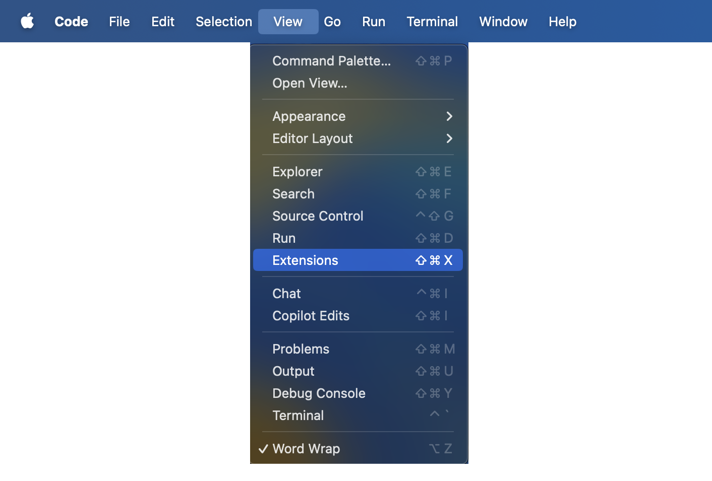
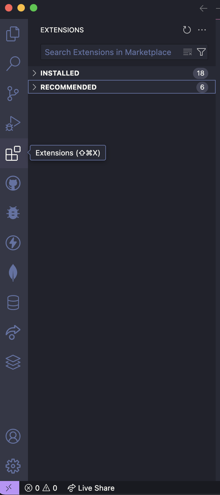
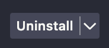
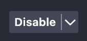
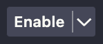

Extensions in Visual Studio Code are add-ons that enhance functionality by providing support for additional languages, debugging tools, themes, and integrations with external services. The <i>Extensions Marketplace</i> is a built-in platform where users can explore, <i>install</i>, and manage these extensions to customize their development environment.

## Install a Third-Party Extension

1 . <b>Open</b> Visual Studio Code, and <b>select</b> [View] on the top navigation bar.

<figure markdown="span">
  { width="600" }
</figure>

2 . <b>Select</b> [Extension] from the dropdown menu.

<figure markdown="span">
  { width="600" }
</figure>

!!! tip "Tip"
    Two other ways to access the VS Code <i>Extensions Marketplace</i> are by: 
    
    1) VSC Activity Bar: On the VS Code activity bar select the icon with four squares.
    
    2) Keyboard Shortcut: On your keyboard <b>press</b> ⇧ &#8984 X

<figure markdown="span">
  { width="200" }
</figure>

3 . <b>Search</b> and browse through popular <i>extensions</i> using the extensions searchbar.

4 . <b>Select</b> an <i>extension</i> and then <b>click</b> [Install].

!!! success "Success"
    Once the [Install] Button changes to an [Uninstall] button, you have successfully installed the extension.

## Uninstall an Extension

5 . <b>Select</b> an <i>extension</i> that you would like to <i>uninstall</i>.

6 . <b>Click</b> on the [Uninstall] button.

<figure markdown="span">
  { width="100" }
</figure>

## Disable Or Enable An Extension After Installation 

7 . <b>Select</b> an <i>extension</i> that you would like to <i>disable</i>.

8 . <b>Click</b> on the [Disable] button.

<figure markdown="span">
  { width="100" }
</figure>

9 . <b>Select</b> an <i>extension</i> that you would like to </i>enable</i>.

10 . <b>Click</b> on the [Enable] button.

<figure markdown="span">
  { width="100" }
</figure>

 

!!! tip "Tip"
    Once the [Enable] button changes to a [Disable] button, you have successfully <i>enabled</i> the <i>extension</i>.

!!! success "Success"
    Congratulations! You have successfully learned how to install and configure extensions so you can create your own personalized development environment.
