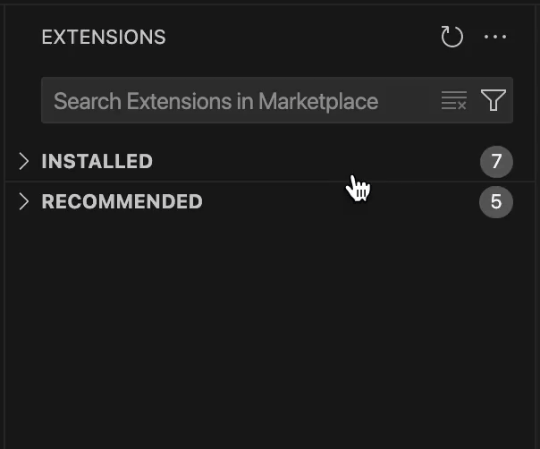
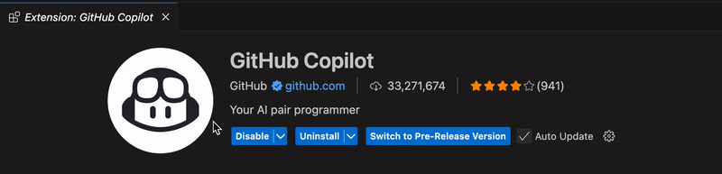
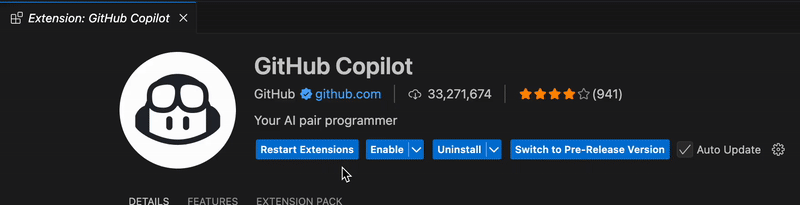
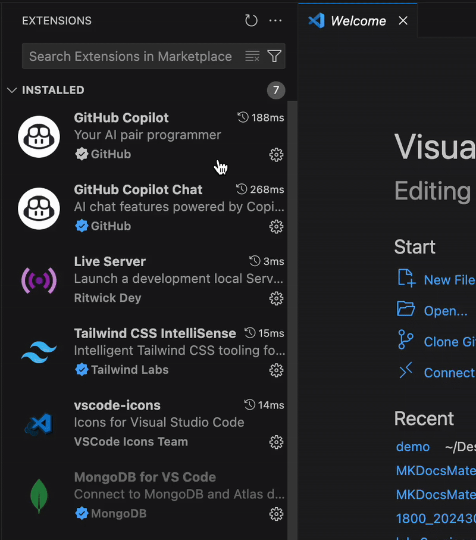
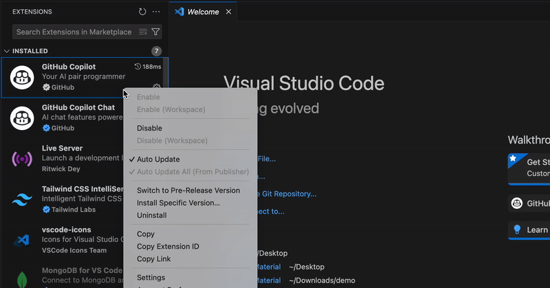

<i>Extensions</i> in Visual Studio Code are add-ons that enhance functionality by providing support for additional languages, debugging tools, themes, and integrations with external services. The <i>Extensions Marketplace</i> is a built-in platform where users can explore and manage these extensions to customize their development environment.

## Install a Third-Party Extension

1. <b>Click</b> [View] → [Extension] to open the Extensions Marketplace.

    <figure markdown="span">
    { width="550" }
    </figure>

!!! tip "Tip"
    Two other ways to access the VS Code <i>Extensions Marketplace</i> are by: 

    i. Keyboard Shortcut: <b>Press</b> ⇧ &#8984 X  on your keyboard

    ii. Activity Bar: <b>Click</b> the [Extensions] icon (with four squares as shown in the above image) on the activity bar.

2. <b>Type</b> the name of the extension you wish to install into the searchbar.

    <figure markdown="span">
    { width="350" }
    </figure>

3. <b>Select</b> an extension to open its information page.

    <figure markdown="span">
    { width="750" }
    </figure>

4. <b>Click</b> the [Install] button under the extension name. Once the [Install] button changes to [Uninstall], the extension has been successfully installed.

    <figure markdown="span">
    { width="600" }
    </figure>

!!! tip "Tip"
    When the installation completes, the newly installed extension will be enabled by default.

## <i>Disable</i>, <i>Enable</i> and Uninstall an Extension

1. <b>Select</b> [View] → [Extension] to open the Extensions Marketplace.

2. <b>Click</b> [Installed] to expand the dropdown menu, then <b>select</b> the installed extension to view its information page.  

    <figure markdown="span">
    { width="350" }
    </figure>

3. <b>Select</b> the [Disable], [Enable] or [Uninstall] button on the information page.

    <figure markdown="span">
    { width="600" }
    </figure>

4. If you are disabling an extension, you must <b>click</b> [Restart Extensions] after clicking on the [Disable] button to apply the change.

    <figure markdown="span">
    { width="600" }
    </figure>

## Modify Extension Settings 

!!! tip "Tip"
    Modifying the extension settings may provide you a more personalized experience that suits your work habits.

1. <b>Follow</b> the above section to open the Installed dropdown menu.

2. <b>Right-click</b> the extension whose settings you wish to modify.

    <figure markdown="span">
    { width="350" }
    </figure>

3. <b>Select</b> [Settings] to open the setting tab for that extension.

    <figure markdown="span">
    { width="750" }
    </figure>

4. <b>Change</b> the settings as needed to tailor to your preference.

!!! success "Success"
    Hurrah! You can now manage your own extensions in VS Code to personalize your development environment and enhance your productivity.
