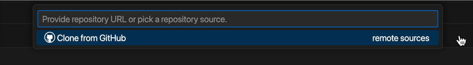
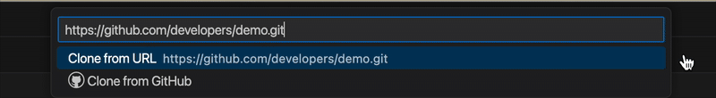
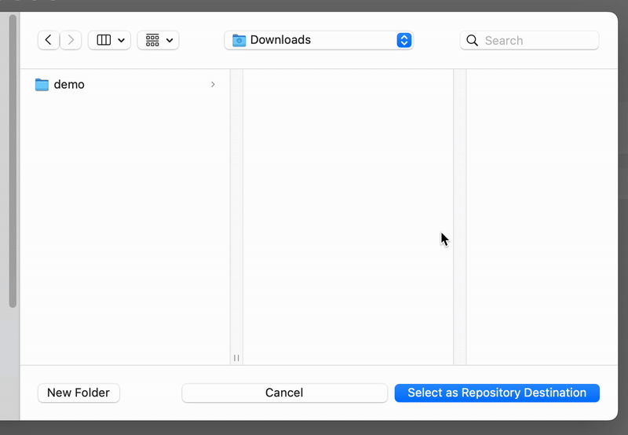
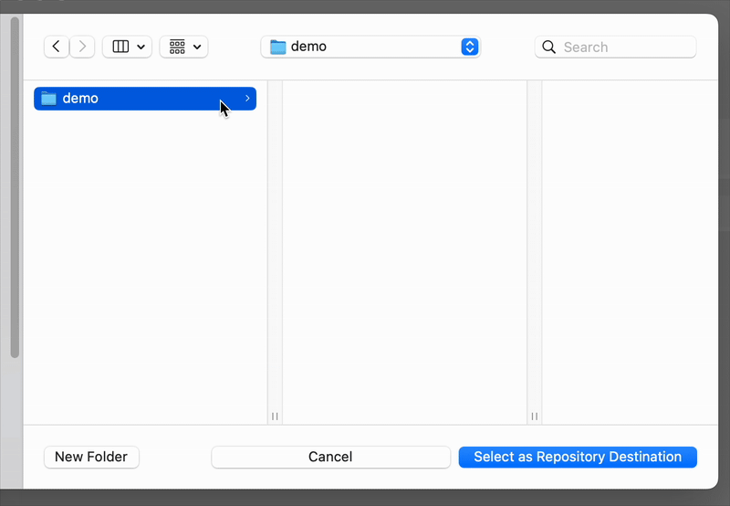
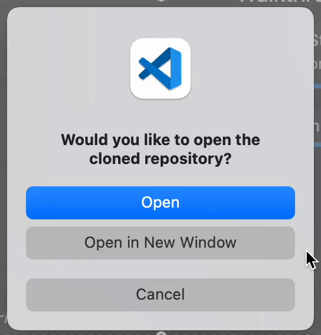
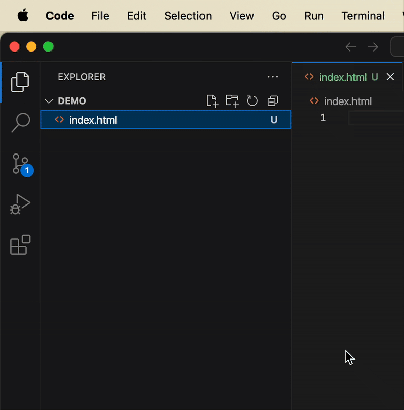
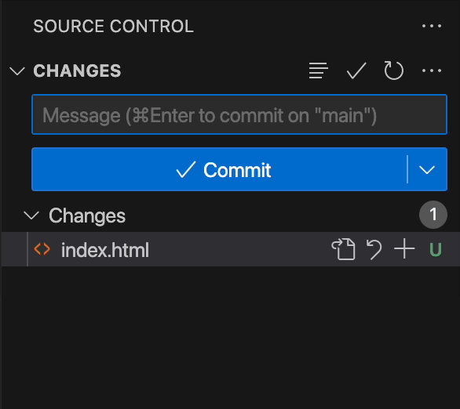
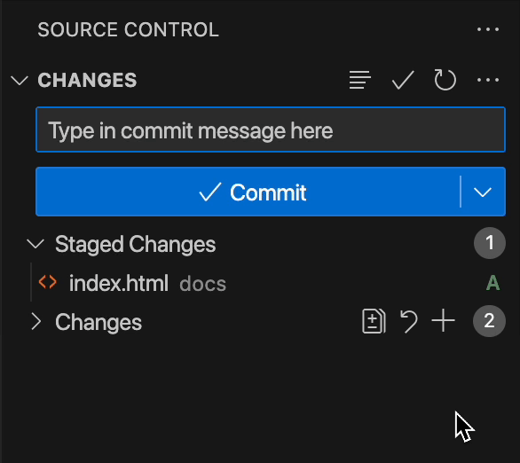
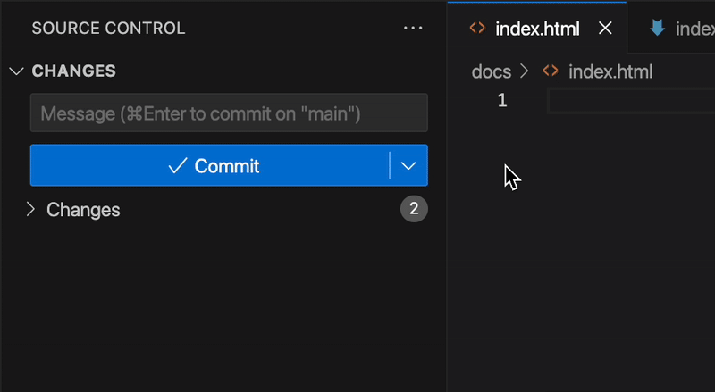

Visual Studio Code provides a development environment which allows developers to share and collaborate on code with ease. This guide outlines the steps to configure an existing GitHub repository on your local computer, setting up a seamless working environment for remote collaboration on your projects.

!!! important
    Before configuring a GitHub repository on your local computer, make sure your GitHub account is linked to VS Code and that you have the GitHub repository URL ready.

## Clone a GitHub Repository to Local Computer

1. **Click** [Clone Git Repository] on the Welcome tab.

    <figure markdown="span">
    { width="350" }
    </figure>

!!! tip "Tip"
    By launching VS Code, you will land on the Welcome tab unless you have opened a project. If you are directed to an existing project, close it by clicking [File] → [Close Folder] to return to the Welcome tab.

2. **Enter** or **paste** the GitHub repository URL into the searchbar.

    <figure markdown="span">
    { width="650" }
    </figure>

3. **Select** [Clone from URL] from the dropdown menu.

    <figure markdown="span">
    { width="650" }
    </figure>

4. **Choose** a local <i>direcotory</i>, i.e. a destination folder, to save the remote repository to.

    <figure markdown="span">
    { width="500" }
    </figure>

5. **Click** [Select as Repository Destination] button to begin the cloning process.

    <figure markdown="span">
    { width="500" }
    </figure>

6. Once the cloning is done, a pop-up window will appear. **Click** [Open] to open the downloaded repository in VS Code.

    <figure markdown="span">
    { width="300" }
    </figure>

## Push to a GitHub Repository from Local Computer

!!! warning "Warning"
    Pushing to a GitHub repository makes your <i>commits</i> visible to anyone with access to the shared repository. Once pushed, your commits cannot be withdrawn or undone.

1. **Click** [View] → [Source Control] to open the Source Control panel.

    <figure markdown="span">
    { width="500" }
    </figure>

2. **Enter** your <i>commit message</i> into the textbox. 

    <figure markdown="span">
    { width="350" }
    </figure>

3. **Click** [✔ Commit] to commit your edits.

    <figure markdown="span">
    { width="350" }
    </figure

4. When ready, **click** [⋯] → [Push] on the Source Control panel to push your changes to the remote GitHub repository. The [⋯] button appears only when you hover over the Source Control panel.

    <figure markdown="span">
    { width="550" }
    </figure>

!!! success "Success"
    Congratulations! You can now begin collaborating with other developers in VS Code by cloning a GitHub repository to and pushing your progress from your local computer.