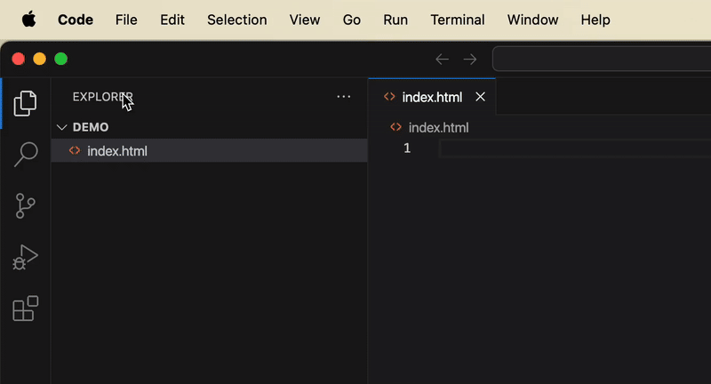

Visual Studio Code provides the flexibility of customizing keyboard shortcuts, allowing you to tailor the <i>hotkeys</i> to your preferences. By default, VS Code bundles pre-defined shortcuts for common actions when installed. This instruction guides you through the process of adding, changing, and removing keyboard shortcuts, helping you optimize your user experience and enhance productivity.

## Customize a Keyboard Shortcut

1. **Click** [Code] → [Settings] → [Keyboard Shortcuts] to open the Keyboard Shortcuts tab.

<figure markdown="span">
{ width="400" }
</figure>

2. **Type** the action you would like to customize into the search bar (e.g. "Save", "Open File", etc).
 
3. **Right-click** on the action you wish to modify.

4. **Select** one of the following options:
    - [Change Keybinding] — to modify the current hotkey; or
    - [Add Keybinding] — to assign a new hotkey; or
    - [Remove Keybinding] — to remove the existing hotkey.

5. **Enter** your desired key combination for the selected action if your are adding or changing keybinding, then **press** [Enter] to confirm.

## Resolve a Key Conflict

!!! important "Important"
    Changing keyboard shortcuts may sometimes causes key conflicts where more than one action is assigned to the same key combination. If your keyboard shortcuts are malfunctioning, following this section to solve the issue.

1. **Select** [Code] → [Settings] → [Keyboard Shortcuts].

2. **Click** [keyboard] icon on the right-hand side of the search bar.

3. **Right-click** under the Keybinding column to open a menu.

4. **Click** [Show Same Keybindings] to generate a list of all actions binded to the same hotkey.

5. **Review** the list to ensure your chosen hotkey is not already in use by other action. If there is a key conflict, **follow** the steps from the previous section to remove or change the conflicting keybinding.

!!! success "Success"
    Cheers! You have successfully learned how to set up hotkeys for VS Code to boost up your productivity.