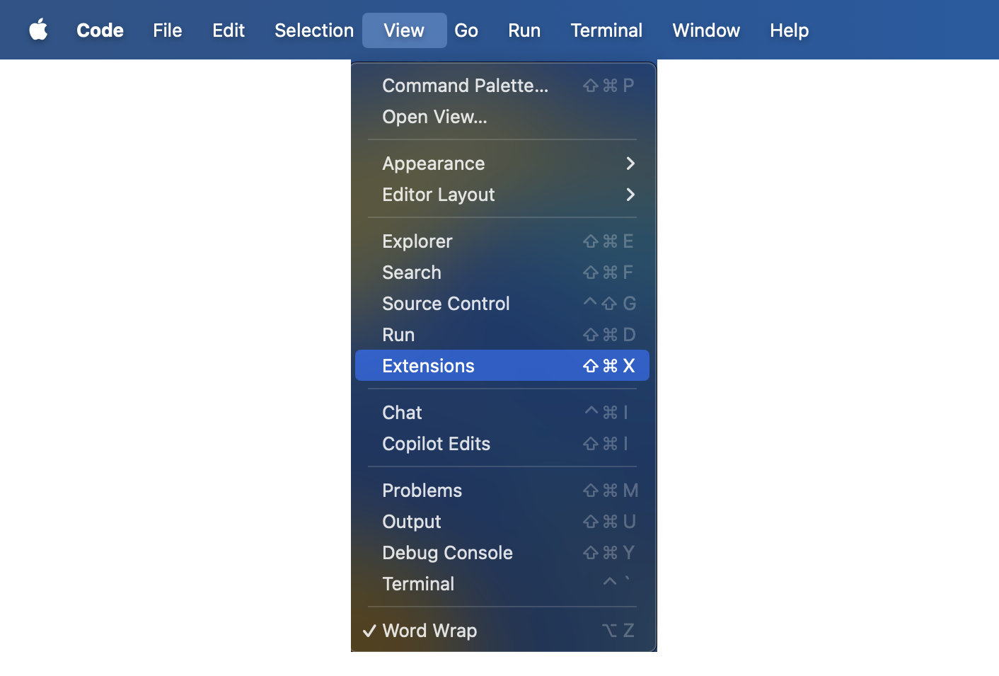
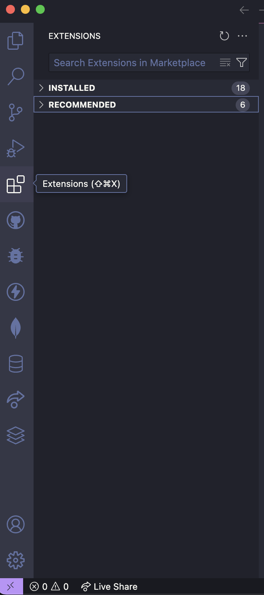

## Overview
Extensions in Visual Studio Code are add-ons that enhance functionality by providing support for additional languages, debugging tools, themes, and integrations with external services. The Extensions Marketplace is a built-in platform where users can explore, install, and manage these extensions to customize their development environment.

### Install Third-Party Extensions

1. <b>Open</b> Visual Studio Code and select the View tab on your machines top navigation bar

<figure markdown="span">
  { width="600" }
  <figcaption>Image caption</figcaption>
</figure>

2. <b>Select</b> the Extension Tab from the list

<figure markdown="span">
  { width="600" }
  <figcaption>Image caption</figcaption>
</figure>

!!! tip "Tip"
    To access the Extensions Marketplace shortcut, <b>Click</b> on the Visual Studio Code interface and select the Extension Tab on the left side navigation bar.
    
    You can also use the keyboard shortcut ⇧ &#8984 X

<figure markdown="span">
  { width="200" }
  <figcaption>Image caption</figcaption>
</figure>

3. <b>Search</b> and browse through popular extensions using the extensions searchbar.

4. <b>Select</b> an extension and then <b>click</b> on the install button

!!! success "Success"
Once the <i>Install</i> Button changes to an <i>Uninstall</i> button, you have successfully installed the extension

### Uninstall an extension

1. <b>Select</b> an extension that you would like to uninstall

2. <b>Click</b> on the uninstall button

### Disable an extension

1. <b>Select</b> an extension that you would like to deactivate

2. <b>Click</b> on the disable button

### Enable an extension

1. <b>Select</b> an extension that you would like to Enable

2. <b>Click</b> on the Enable button

!!! success "Success"
  Once the <i>Enable</i> Button changes to an <i>Disable</i> button, you have successfully enabled the extension
